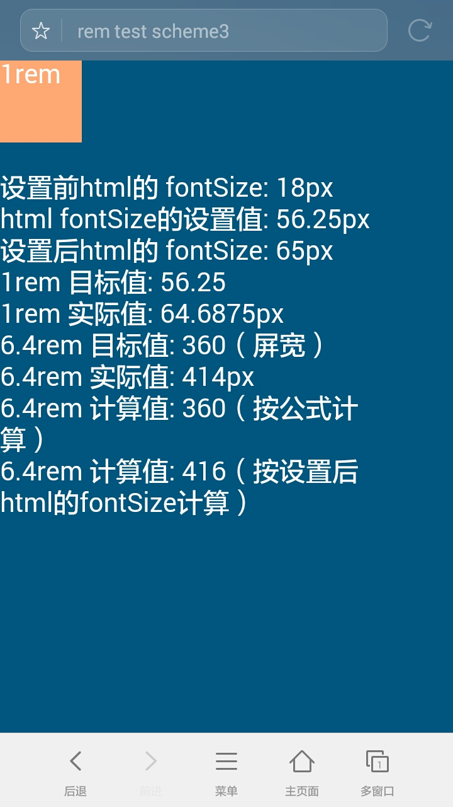
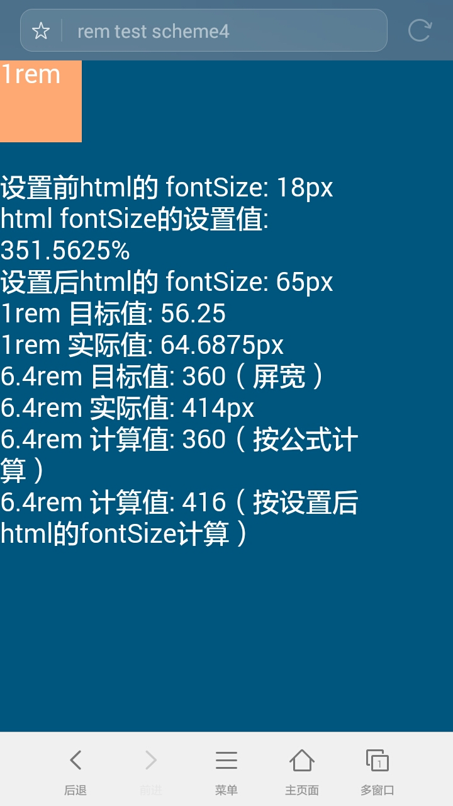
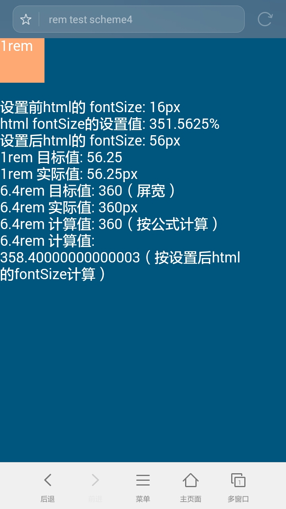
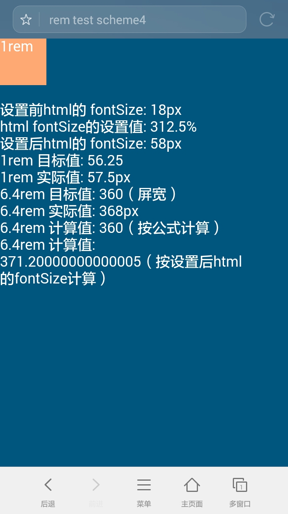
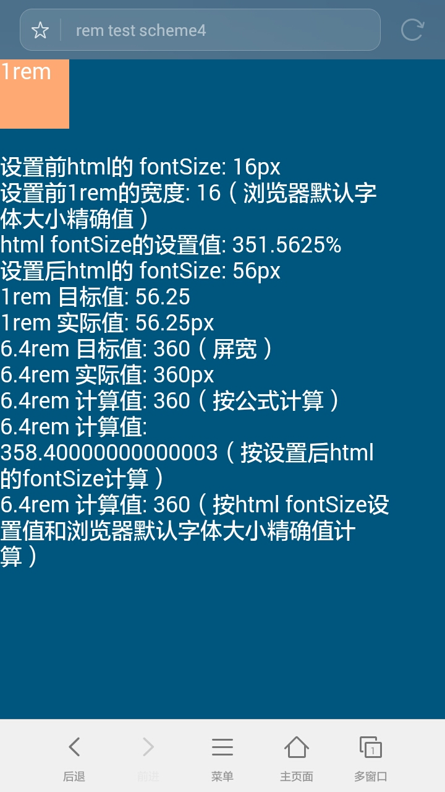
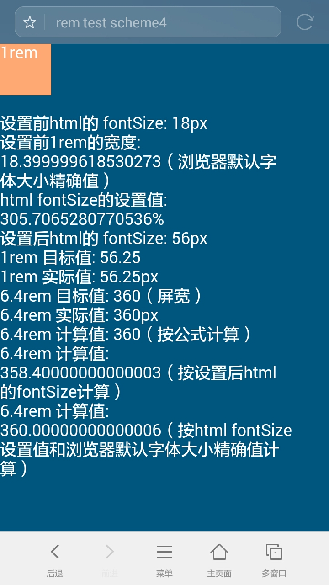

# 了解真实的『REM』手机屏幕适配

`rem` 作为一个低调的长度单位，由于手机端网页的兴起，在眼下针对手机屏幕的适配中有着举足轻重的作用。使用 `rem` 前端开发者可以很方便的在各种屏幕尺寸下通过`等比缩放的方式`都达到设计图要求的效果。根据官方定义『The font size of the root element.』，即以根节点的字体大小作为基准值进行长度计算。一般认为网页中的根节点是 `html` 元素，所以采用的方式也是通过设置 `html` 元素的 `font-size` 来做屏幕适配，但实际情况真有这么简单吗？

首先我们来看看常用的使用 `rem` 是怎么实现手机屏幕适配的。<br/>

以设计稿的宽度为`640px`，同时设定在640px屏宽的屏幕下 `1rem=100px` 。

> 设置 `1rem=100px` 的优点不言而喻。前端开发者切图、重构页面的时候，直接通过加小数点的方式，就可以将UI图中测量到的 `px` 值换算成对应的 `rem` 值，方便快捷。

> 此外，在 `head` 中我们还设置了：`<meta name="viewport" content="width=device-width, initial-scale=1.0, minimum-scale=1.0, maximum-scale=1.0" />` <br/>viewport的作用很重要但不是本文的重点所以不展开，有兴趣的同学可以自行搜索。

先来看看具体方案：

>下面四个方案来自同事共享，其原理都是一样的，不同的只是在于性能取舍和书写习惯，

#### 方案1

``` css
@media screen and (min-width: 320px) {html{font-size:50px;}}
@media screen and (min-width: 360px) {html{font-size:56.25px;}}
@media screen and (min-width: 375px) {html{font-size:58.59375px;}}
@media screen and (min-width: 400px) {html{font-size:62.5px;}}
@media screen and (min-width: 414px) {html{font-size:64.6875px;}}
@media screen and (min-width: 440px) {html{font-size:68.75px;}}
@media screen and (min-width: 480px) {html{font-size:75px;}}
@media screen and (min-width: 520px) {html{font-size:81.25px;}}
@media screen and (min-width: 560px) {html{font-size:87.5px;}}
@media screen and (min-width: 600px) {html{font-size:93.75px;}}
@media screen and (min-width: 640px) {html{font-size:100px;}}
@media screen and (min-width: 680px) {html{font-size:106.25px;}}
@media screen and (min-width: 720px) {html{font-size:112.5px;}}
@media screen and (min-width: 760px) {html{font-size:118.75px;}}
@media screen and (min-width: 800px) {html{font-size:125px;}}
@media screen and (min-width: 960px) {html{font-size:150px;}}
```

#### 方案2

``` css
@media screen and (min-width: 320px) {html{font-size:312.5%;}}
@media screen and (min-width: 360px) {html{font-size:351.5625%;}}
@media screen and (min-width: 375px) {html{font-size:366.211%;}}
@media screen and (min-width: 400px) {html{font-size:390.625%;}}
@media screen and (min-width: 414px) {html{font-size:404.2969%;}}
@media screen and (min-width: 440px) {html{font-size:429.6875%;}}
@media screen and (min-width: 480px) {html{font-size:468.75%;}}
@media screen and (min-width: 520px) {html{font-size:507.8125%;}}
@media screen and (min-width: 560px) {html{font-size:546.875%;}}
@media screen and (min-width: 600px) {html{font-size:585.9375%;}}
@media screen and (min-width: 640px) {html{font-size:625%;}}
@media screen and (min-width: 680px) {html{font-size:664.0625%;}}
@media screen and (min-width: 720px) {html{font-size:703.125%;}}
@media screen and (min-width: 760px) {html{font-size:742.1875%;}}
@media screen and (min-width: 800px) {html{font-size:781.25%;}}
@media screen and (min-width: 960px) {html{font-size:937.5%;}}
```

#### 方案3

```js
var designWidth = 640, rem2px = 100;
document.documentElement.style.fontSize = 
  window.innerWidth / designWidth * rem2px + 'px';
```

#### 方案4

```js
var designWidth = 640, rem2px = 100;
document.documentElement.style.fontSize = 
  window.innerWidth / designWidth * rem2px / 16 * 100 + '%';
```

这里只给出了方案3和方案4对应验证页面: [scheme3.html](./sheme3.html), [scheme4.html](./sheme4.html)<br/>
> 如下面两张图为在屏宽为360px下的效果，1rem = 56.25px。方案3设置值为：`56.25px`，方案4设置值为：`351.5625%`

方案3|方案4
---|---
|

如下：<br/>

`rem` 和 `px` 直接的转换公式可以写为，

`1rem = 1 * htmlFontSize`

方案1中的

```css
@media screen and (min-width: 640px) {html{font-size:100px;}}
```

在屏宽为`640px`情况下，可以很明显的表现出这一点 `1rem = 1 * 100px` ，同我们最初的设定。那么我们要得到其它屏幕大小的 `htmlFontSize` 值要怎么办了，很简单，如方案3：

```js
window.innerWidth / designWidth * rem2px + 'px'
```

由于浏览器默认的字体大小为 `16px`, 所以当我们想使用百分比作为根节点 `html` 的字体大小时，即 `htmlFontSize` 是一个百分比值，而不是一个带有`px`单位的值，`rem` 的计算方式就会改为：

`1rem = 1 * htmlFontSize * 16px`

如方案2中

```css
@media screen and (min-width: 640px) {html{font-size:625%;}}
```

应用上面的公式：

```js
1rem = 1 * 625% * 16px
其中：625% * 16 = 6.25 * 16 = 100
所以：1rem = 1 * 100px
```
同样的可以得到所有屏幕大小下，`html` 的 `font-size` 值的计算公式，即为方案4：

```js
window.innerWidth / designWidth / 16 * 100 * rem2px + '%'
```

通过方案3和方案4的公式，就可以很方便的生成方案1和方案2中的css。<br/>

到目前为止貌似很完美的解决了问题，实际情况当然是出现了意外。在有些 Android 手机上，浏览器或 webview 的默认字体是随着系统设置的字体改变的。这样就会导致默认字体大于或小于 `16px`。<br/>
反过来我们再看方案3和方案4（方案1和方案2是它们的变形）。<br/>

同样在屏宽为360px下，我们调大系统字体大小，如下面的效果<br/>
>设置前html的字体大小改为 `18px` ，设置后为 `65px` ，由于屏幕宽度没有改变，我们的目标值任然为 `56.25px`，同样我们的设置值也没有变化 ，而最终效果出现了偏差。

方案3|方案4
---|---
|

先来看方案3和方案4的实际计算方式：

方案3：

```js
// 在 360px 下
document.documentElement.style.fontSize = 56.25px
1rem = 1 * 56.25px
实际为：
1rem = 64.6875px
```
方案4：

```js
// 在 360px 下
document.documentElement.style.fontSize = 351.5625%
1rem = 1 * 351.5625% * 18px
351.5625% * 18 = 63.28125
实际为：
1rem = 64.6875px
```
貌似方案4的计算结果很接近实际效果，而方案3偏差很大。再来比较方案3和方案4的计算公式：

```js
// 方案3
document.documentElement.style.fontSize = 
  window.innerWidth / designWidth * rem2px + 'px';

// 方案4
document.documentElement.style.fontSize = 
  window.innerWidth / designWidth * rem2px / 16 * 100 + '%';
```
方案4较于方案3其实多除了一个16，说明浏览器在计算 `rem` 的具体值时，如果 `html` 设置的 `font-size` 为 `px` 值时会先除以 `16` ，然后再乘以 `htmlFontSize`。

```js
1rem = 1 * (56.25px / 16) * 18
1 * (56.25 / 16) * 18 = 63.28125
```
方案4存在问题，是因为系统的默认字体改为了 `18px` ，但是我们在计算百分比是时候，还是以 `16px` 为基准值进行计算，所以出现偏差（计算值和实际值之间还有一点偏差这个在后面会提到）。<br/>
在方案3中，我们其实是不考虑浏览器默认字体的，但在实际使用的过程中，浏览器还是除了 `16` ，而此时默认字体为 `18px`。所以可以推断这里的 `16` 是不随系统字体大小而改变的。
得出如下在 `html` 的 `fontSize` 设置为 `px` 的情况下 `rem` 的计算公式为：

```js
1rem = 1 * (htmlFontSize / 16) * defaultFontSize
```

在字体大小发生改变时，`defaultFontSize` 会跟着改变，而 `16` 不会变化。所以方案3虽然表面上不考虑系统字体的变化，只关注屏幕与设计稿之间的宽度比，但在实际计算中还是使用到了系统字体大小，而且还有一个不变的 `16` 在作祟，导致方案3失败。<br/>

方案4因为在计算时就引入了根节点字体大小 `16px`。所以它的偏差在于没能动态的获取根节点的字体大小。更新如下：<br/>

方案4.1

```js
var designWidth = 640, rem2px = 100;
var h = document.getElementsByTagName('html')[0];
var htmlFontSize = parseFloat(window.getComputedStyle(h, null).getPropertyValue('font-size'));
document.documentElement.style.fontSize = 
  window.innerWidth / designWidth * rem2px / htmlFontSize * 100 + '%';
```
效果如下图：

> `16px` 的图中，设置后的html的fontSize与1rem的实际值有偏差，同时`6.4rem` 的计算值出现的偏差。通过查看代码发现html的fontSize使用的是： `getPropertyValue('font-size')` 而 `1rem` 使用的是 `getPropertyValue('width')`，`font-size`在计算的时候进行了四舍五入。
> `18px` 中的偏差，以及上文中方案4在 `18px` 实际值和计算值出现的偏差都是同样的问题。所以基准值还需要修改。

16px|18px
---|---
|

方案4.2

```js
var designWidth = 640, rem2px = 100;
var d = window.document.createElement('div');
d.style.width = '1rem';
d.style.display = "none";
var head = window.document.getElementsByTagName('head')[0];
head.appendChild(d);
var defaultFontSize = parseFloat(window.getComputedStyle(d, null).getPropertyValue('width'));
d.remove();
document.documentElement.style.fontSize = 
  window.innerWidth / designWidth * rem2px / defaultFontSize * 100 + '%';
```

效果如下图：

16px|18px
---|---
|

到此为止，`rem` 在默认字体不是 `16px` 的情况下的处理已经解决，考虑到还有设计屏幕旋转，最终手机端的解决方案为：

```js
function adapt(designWidth, rem2px){
  var d = window.document.createElement('div');
  d.style.width = '1rem';
  d.style.display = "none";
  var head = window.document.getElementsByTagName('head')[0];
  head.appendChild(d);
  var defaultFontSize = parseFloat(window.getComputedStyle(d, null).getPropertyValue('width'));
  d.remove();
  document.documentElement.style.fontSize = window.innerWidth / designWidth * rem2px / defaultFontSize * 100 + '%';
  var st = document.createElement('style');
  var portrait = "@media screen and (min-width: "+window.innerWidth+"px) {html{font-size:"+ ((window.innerWidth/(designWidth/rem2px)/defaultFontSize)*100) +"%;}}";
  var landscape = "@media screen and (min-width: "+window.innerHeight+"px) {html{font-size:"+ ((window.innerHeight/(designWidth/rem2px)/defaultFontSize)*100) +"%;}}"
  st.innerHTML = portrait + landscape;
  head.appendChild(st);
  return defaultFontSize
};
var defaultFontSize = adapt(640, 100);
```


